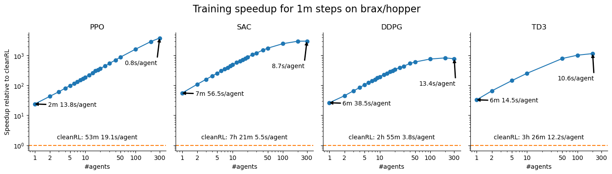
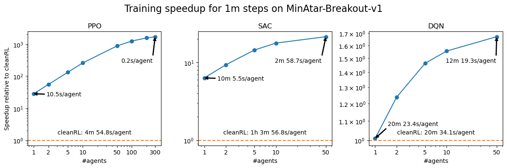

<div style="display: flex; align-items: center">
<div style="flex-shrink: 0.5; min-width: 30px; max-width: 150px; aspect-ratio: 1; margin-right: 15px">
  </img>
</div>
<div>
  <h1>
    Rejax
    <br>
    <span style="font-size: large">Hardware-Accelerated Reinforcement Learning Algorithms in pure Jax!</span>
    <br>
    <a href="https://colab.research.google.com/github/kerajli/rejax/blob/master/examples/rejax_tour.ipynb">
      
    </a>
    <a href="https://github.com/psf/black">
      
    </a>
    <a href="https://opensource.org/licenses/Apache-2.0">
      
    </a>
    <a href="https://badge.fury.io/py/rejax">
      
    </a>
  </h1>
  </div>
</div>
<br>

Rejax is a library of RL algorithms which are implemented in pure Jax. 
It allows you to accelerate your RL pipelines by using `jax.jit`, `jax.vmap`, `jax.pmap` or any other transformation on whole training algorithms.
Use it to quickly search for hyperparameters, evaluate agents for multiple seeds in parallel, or run meta-evolution experiments on your GPUs and TPUs.
If you're new to <strong>rejax</strong> and want to learn more about it,
<h3 align="center">
<a href="https://colab.research.google.com/github/kerajli/rejax/blob/master/examples/rejax_tour.ipynb" style="margin-right: 15px">
  
</a>
📸 Take a tour
</h3>


## 🏗 Installing rejax
1. Install via pip: `pip install rejax`
2. Install from source: `pip install git+https://github.com/keraJLi/rejax`

## ⚡ Vectorize training for incredible speedups!
- Use `jax.jit` on the whole train function to run training exclusively on your GPU!
- Use `jax.vmap` and `jax.pmap` on the initial seed or hyperparameters to train a whole batch of agents in parallel! 

```python
from rejax import SAC

# Get train function and initialize config for training
algo = SAC.create(env="CartPole-v1", learning_rate=0.001)

# Jit the training function
train_fn = jax.jit(algo.train)

# Vmap training function over 300 initial seeds
vmapped_train_fn = jax.vmap(train_fn)

# Train 300 agents!
keys = jax.random.split(jax.random.PRNGKey(0), 300)
train_state, evaluation = vmapped_train_fn(keys)
```

Benchmark on an A100 80G and a Intel Xeon 4215R CPU. Note that the hyperparameters were set to the default values of cleanRL, including buffer sizes. Shrinking the buffers can yield additional speedups due to better caching, and enables training of even more agents in parallel.





## 🤖 Implemented algorithms
| Algorithm | Link | Discrete | Continuous | Notes                                                                          |
| --------- | ---- | -------- | ---------- | ------------------------------------------------------------------------------ |
| PPO       | [here](https://github.com/keraJLi/rejax/blob/main/src/rejax/algos/ppo.py) | ✔        | ✔          |                                                                                |
| SAC       | [here](https://github.com/keraJLi/rejax/blob/main/src/rejax/algos/sac.py) | ✔        | ✔          | discrete version as in [Christodoulou, 2019](https://arxiv.org/abs/1910.07207) |
| DQN       | [here](https://github.com/keraJLi/rejax/blob/main/src/rejax/algos/dqn.py) | ✔        |            | incl. DDQN, Dueling DQN                                                        |
| PQN       | [here](https://github.com/keraJLi/rejax/blob/main/src/rejax/algos/pqn.py) | ✔        |            |                                                                                |
| IQN       | [here](https://github.com/keraJLi/rejax/blob/main/src/rejax/algos/iqn.py) | ✔        |            |                                                                                |
| TD3       | [here](https://github.com/keraJLi/rejax/blob/main/src/rejax/algos/td3.py) |          | ✔          |                                                                                |


## 🛠 Easily extend and modify algorithms
The implementations focus on clarity! 
Easily modify the implemented algorithms by overwriting isolated parts, such as the loss function, trajectory generation or parameter updates.
For example, easily turn DQN into DDQN by writing
```python
class DoubleDQN(DQN):
    def update(self, state, minibatch):
        # Calculate DDQN-specific targets
        targets = ddqn_targets(state, minibatch)

        # The loss function predicts Q-values and returns MSBE
        def loss_fn(params):
            ...
            return jnp.mean((targets - q_values) ** 2)

        # Calculate gradients
        grads = jax.grad(loss_fn)(state.q_ts.params)

        # Update train state
        q_ts = state.q_ts.apply_gradients(grads=grads)
        state = state.replace(q_ts=q_ts)
        return state
```

## 🔙 Flexible callbacks
Using callbacks, you can run logging to the console, disk, wandb, and much more. Even when the whole train function is jitted! For example, run a jax.experimental.io_callback regular intervals during training, or print the current policies mean return:

```python
def print_callback(algo, state, rng):
    policy = make_act(algo, state)           # Get current policy
    episode_returns = evaluate(policy, ...)  # Evaluate it
    jax.debug.print(                         # Print results
        "Step: {}. Mean return: {}",
        state.global_step,
        episode_returns.mean(),
    )
    return ()  # Must return PyTree (None is not a PyTree)

algo = algo.replace(eval_callback=print_callback)
```

Callbacks have the signature `callback(algo, train_state, rng) -> PyTree`, which is called every `eval_freq` training steps with the config and current train state. The output of the callback will be aggregated over training and returned by the train function. The default callback runs a number of episodes in the training environment and returns their length and episodic return, such that the train function returns a training curve.

Importantly, this function is jit-compiled along with the rest of the algorithm. However, you can use one of Jax's callbacks such as `jax.experimental.io_callback` to implement model checkpoining, logging to wandb, and more, all while maintaining the advantages of a completely jittable training function.

## 💞 Alternatives in end-to-end GPU training
Libraries:
- [Brax](https://github.com/google/brax/) along with several environments, brax implements PPO and SAC within their environment interface

Single file implementations:
- [PureJaxRL](https://github.com/luchris429/purejaxrl/) implements PPO, recurrent PPO and DQN
- [Stoix](https://github.com/EdanToledo/Stoix) features DQN, DDPG, TD3, SAC, PPO, as well as popular extensions and more

## ✍ Cite us!
```bibtex
@misc{rejax, 
  title={rejax}, 
  url={https://github.com/keraJLi/rejax}, 
  journal={keraJLi/rejax}, 
  author={Liesen, Jarek and Lu, Chris and Lange, Robert}, 
  year={2024}
} 
```
